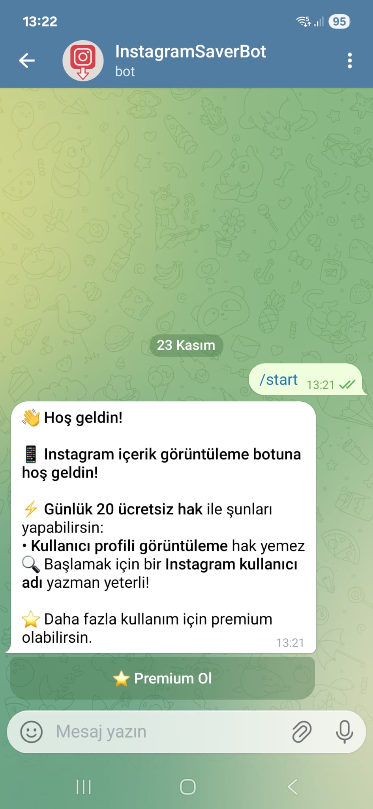
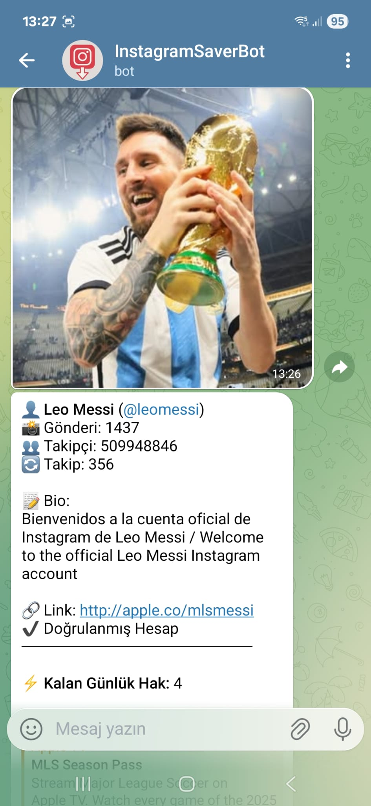
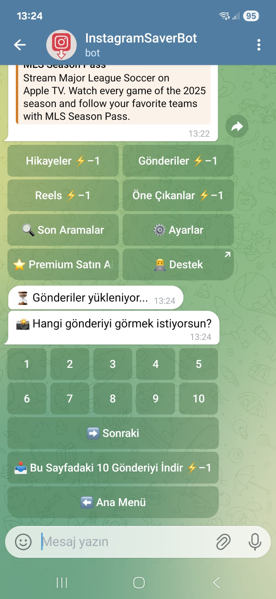
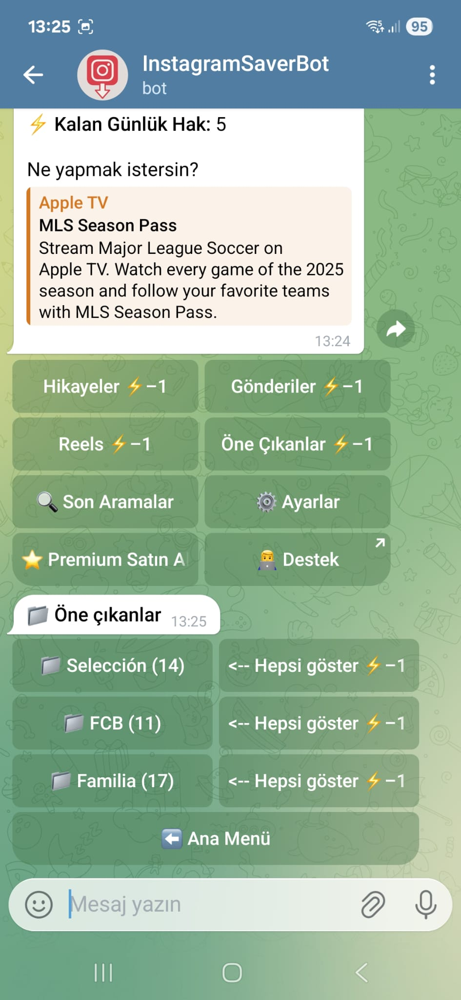
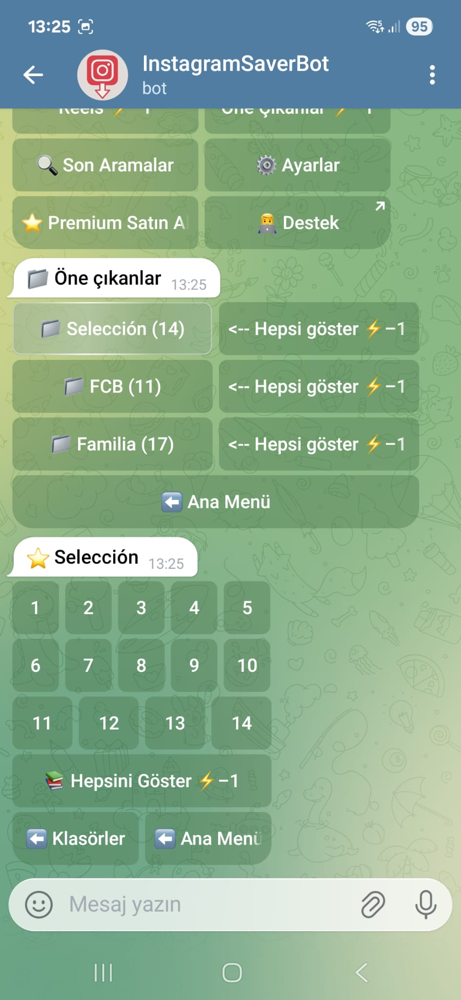

# TelegramIGBot – Instagram İçerik İndirme & Premium Sistemi Botu

Bu proje, Telegram üzerinde Instagram içeriklerini (story, highlight, reel, post, carousel) indirmeye yarayan gelişmiş bir bottur. Ayrıca günlük limit ve premium sistemi içerir. Backend tamamen FastAPI ile yazılmıştır ve Telegram botu Python (python-telegram-bot) kullanır.

---

## 🚀 Özellikler

- Instagram story, highlight, reel, fotoğraf ve video indirme
- Günlük kullanım limiti (backend üzerinden kontrol)
- Premium kullanıcı sistemi (Shopier / Telegram Payments entegrasyonuna uygun altyapı)
- Backend API ile iletişim
- Premium kontrolü, premium ekleme, loglama
- Modüler bot yapısı (handlers klasörleri)
- Async yapı (python-telegram-bot v20+)

---

## 📁 Proje Yapısı

```
root/
│── handlers/              # Botun işlem dosyaları
│── backend/               # FastAPI backend
│── utils/                 # Yardımcı fonksiyonlar
│── services/              # Backend servisleri (premium, limits vb.)
│── igapi/                 # Instagram private API
│── config.py              # Config ayarları
│── bot.py                 # Telegram botunun giriş dosyası
│── requirements.txt       # Gerekli paketler
```

---

## 📸 Ekran Görüntüleri

<div align="center">

<table>
  <tr>
    <td></td>
    <td></td>
    <td></td>
  </tr>
  <tr>
    <td></td>
    <td></td>
  </tr>
</table>

</div>

---

## ⚙️ Kurulum

### 1. Gerekli paketleri yükle

```bash
pip install -r requirements.txt
```

### 2. Config dosyasını düzenle

`config.py` içinde:

```python
BOT_TOKEN = "telegram_bot_token"
BACKEND_URL = "http://127.0.0.1:8000"
```

---

## 🖥️ Backend'i Başlatma

Backend klasörüne gidin:

```bash
cd backend
uvicorn app:app --reload
```

Backend şu adreste çalışır:

```
http://127.0.0.1:8000
```

---

## 🤖 Telegram Botu Başlatma

Ana dizinde:

```bash
python bot.py
```

Bot artık aktif.

---

## 📌 Premium Sistemi Nasıl Çalışır?

Backend içinde:

- Premium ekleme → `/premium/add`
- Premium kontrol → `/premium/check/{telegram_id}`
- Günlük limit kontrolü → `/limit/check/{telegram_id}`

Premium satın alan kullanıcı backend üzerinden premium olarak işaretlenir.

---

## 🧪 Test Ortamı

Geliştirme aşamasında backend ve bot local çalıştırılabilir.
Production için:

- DigitalOcean, AWS, Hetzner veya Railway tavsiye edilir.
- MySQL veritabanı bağlanabilir.

---

## 📜 Lisans

Bu proje **kişisel geliştirme projesidir**. İsteğe göre MIT lisansı eklenebilir.

---

## 👤 Geliştirici

**Yunus** tarafından geliştirilmiştir.
